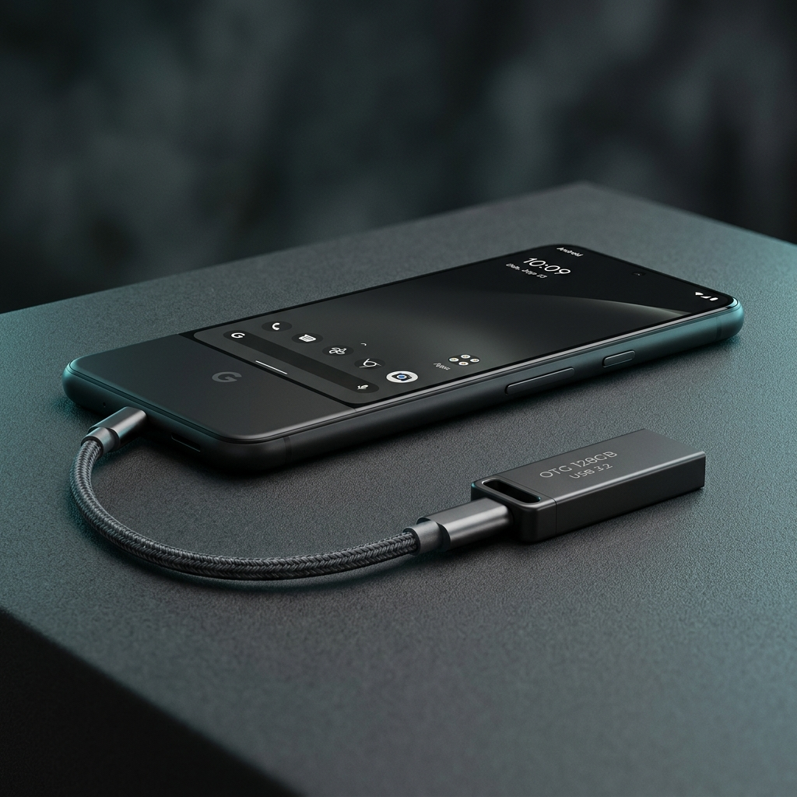
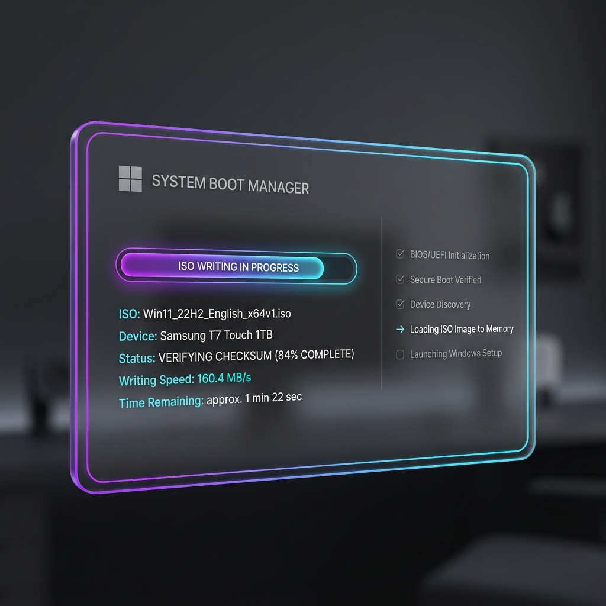
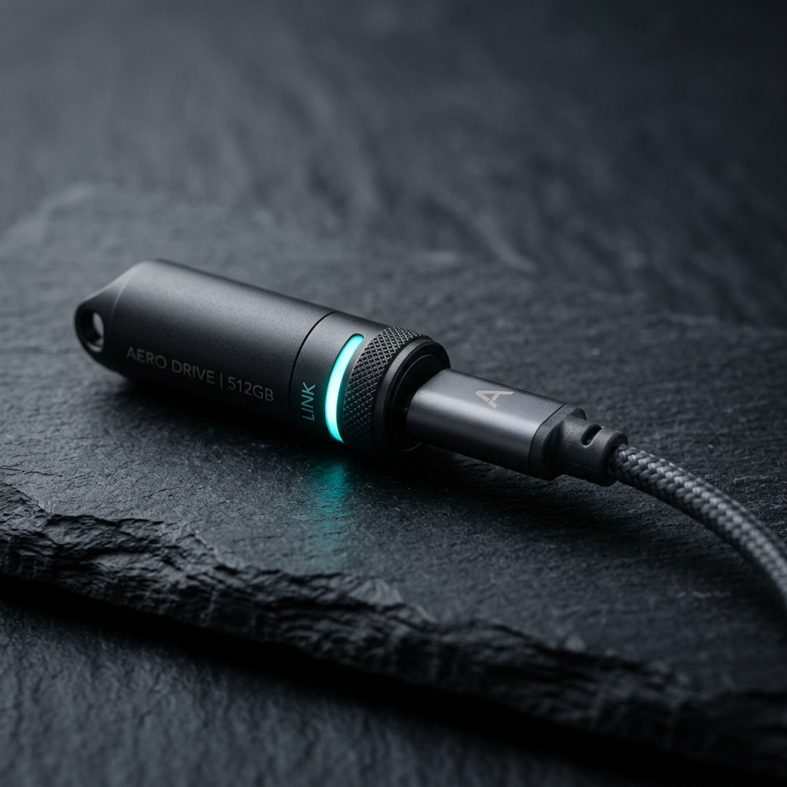

<div align="center">
  

  # BootForge

  ### Boot Windows & Linux USBs Directly from Android

  [](https://bootforge.me)
  [](https://bootforge.me)
  [](https://bootforge.me)
  [](https://bootforge.me)
  [](https://bootforge.me)

  ---
</div>

## 📖 Overview

**BootForge** is the official web showcase and binary distribution hub for the BootForge Android engine — a system utility that turns Android smartphones into hardware-level USB block flashers. Zero PC is required to create bootable Windows and Linux USB installation media.

> [!NOTE]
> **Repository Scope**: This repository contains **only the official public website** for BootForge, deployed live at [https://bootforge.me](https://bootforge.me).

---

## ⚡ Key Features

- 📱 **Zero PC Requirement**: Create bootable USB installation drives directly from your Android phone using a standard USB-C OTG adapter.
- ⚙️ **Dual-Partition Architecture**: Automatically plans a FAT32 boot partition alongside an exFAT data partition to support oversized `install.wim` files (>4GB) for modern Windows releases.
- 🛡️ **Bit-by-Bit Verification**: Performs a content integrity verification pass against the source ISO image before safe drive unmount to guarantee boot success.
- 🚀 **Native arm64 Speed**: Operates via low-level userspace SCSI Bulk-Only Transport for high-throughput write speeds without requiring root access.
- ⚡ **Windows 11 Bypass Ready**: Built-in support for bypass flags targeting TPM 2.0, Secure Boot, and RAM hardware checks during installation media creation.

---

## 🆚 Why BootForge?

| Feature | BootForge (Android OTG) | Traditional Desktop Flashers | Standard Android Apps |
| :--- | :---: | :---: | :---: |
| **PC Required?** | ❌ **No PC Needed** | ⚠️ Requires Working PC | ❌ No PC Needed |
| **Root Required?** | ❌ **No Root Needed** | N/A | ⚠️ Often Requires Root |
| **>4GB WIM Support** | ✅ **Automated Dual Partition** | ✅ Supported | ❌ Fails on >4GB Files |
| **UEFI Boot Ready** | ✅ **Standard Rufus/MCT Layout** | ✅ Supported | ⚠️ Limited Compatibility |
| **Integrity Checks** | ✅ **Bit-by-Bit Pass** | ✅ Supported | ❌ None |

---

## 📱 Supported Android Versions

| Android Version | API Level | Support Status | Architecture |
| :--- | :---: | :---: | :---: |
| **Android 15 (Vanilla Ice Cream)** | API 35 | ✅ Fully Supported | arm64-v8a |
| **Android 14 (Upside Down Cake)** | API 34 | ✅ Fully Supported | arm64-v8a |
| **Android 13 (Tiramisu)** | API 33 | ✅ Fully Supported | arm64-v8a |
| **Android 12 / 12L (Snow Cone)** | API 31 / 32 | ✅ Fully Supported | arm64-v8a |
| **Android 11 (Red Velvet Cake)** | API 30 | ✅ Fully Supported | arm64-v8a |
| **Android 10 (Q)** | API 29 | ✅ Fully Supported | arm64-v8a |
| **Android 9.0 (Pie)** | API 28 | ✅ Fully Supported | arm64-v8a |
| **Android 8.0 / 8.1 (Oreo)** | API 26 / 27 | ✅ Minimum Requirement | arm64-v8a |

---

## 💿 Supported Operating Systems

| Operating System | Image Types | Boot Mode | Partition Layout |
| :--- | :--- | :--- | :--- |
| **Windows 11 (25H2 / 24H2 / 23H2)** | Plain ISO9660 / UDF | UEFI Mode | Dual FAT32 + exFAT |
| **Windows 10 (64-bit / 32-bit)** | Plain ISO9660 / UDF | UEFI / MBR | Dual FAT32 + exFAT |
| **Ubuntu Linux (24.04 LTS / 22.04 LTS)** | Hybrid ISO | UEFI / Legacy | Raw ISO Block Copy |
| **Arch Linux (x86_64)** | Hybrid ISO | UEFI / Legacy | Raw ISO Block Copy |
| **Tails OS (Privacy Live)** | Live ISO | UEFI Mode | Raw ISO Block Copy |
| **WinPE Recovery Tools** | Recovery ISO | UEFI Mode | FAT32 Boot |

---

## 🌐 Official Website & Live Demo

The official website is hosted live with SSL encryption at:

👉 **[https://bootforge.me](https://bootforge.me)**

The website features an interactive real-world boot sequence terminal simulator, hardware OTG speed diagnostics calculator, full product specifications, and direct APK package downloads.

---

## 🖼️ Interface Screenshots

<div align="center">
  <table width="100%">
    <tr>
      <td width="33%" align="center">
        
        <br><sub><b>Hardware OTG Setup</b></sub>
      </td>
      <td width="33%" align="center">
        
        <br><sub><b>Native Android Interface</b></sub>
      </td>
      <td width="33%" align="center">
        
        <br><sub><b>SCSI Speed & Transport</b></sub>
      </td>
    </tr>
  </table>
</div>

---

## 📥 Direct Download

Direct signed APK binaries can be downloaded directly from the official website:

- 📦 **Binary Package**: `BootForge-v2.0.0-Debug.apk`
- 📱 **Target Platform**: Android 8.0 to Android 15+ (`arm64-v8a`)
- 🔗 **Direct Download Link**: [Download BootForge APK](https://bootforge.me/#download)

---

## 🛠️ Technology Stack (Website)

- 🎨 **Design System**: Vanilla CSS3 using a Crimson Red Glassmorphic aesthetics system with soft charcoal neumorphism controls.
- ⚡ **Scripting**: Vanilla JavaScript (ES6+) with zero heavy web framework overhead for optimal page speed.
- 🎬 **Animations**: GSAP (GreenSock Animation Platform) and ScrollTrigger for smooth UI transitions.
- 🌐 **Web Infrastructure**: GitHub Pages deployment with custom domain CNAME routing (`bootforge.me`) and Automated HTTPS.

---

## 📂 Project Structure

```
web-design/
├── index.html                  # Main landing page HTML5 application
├── privacy.html                # Privacy policy & data protection document
├── styles.css                  # Crimson glassmorphic responsive stylesheet
├── main.js                     # Interactive terminal simulator & UI logic
├── server.js                   # Local Node.js HTTP dev server
├── CNAME                       # Custom domain routing (bootforge.me)
├── .nojekyll                   # Bypasses Jekyll build on GitHub Pages
├── robots.txt                  # Search engine crawler directives
├── sitemap.xml                 # Search engine sitemap index
├── site.webmanifest            # PWA web app manifest configuration
├── favicon.ico                 # Multi-resolution favicon icon
├── android-chrome-192x192.png  # PWA app icon (192x192)
├── android-chrome-512x512.png  # PWA app icon (512x512)
├── apple-touch-icon.png        # Apple Touch icon
├── apk/                        # Direct downloadable APK package storage
│   └── BootForge-v2.0.0-Debug.apk
└── assets/
    └── images/                 # Production web render image assets
        ├── creator_vignesh.jpg
        ├── feature_boot_interface.png
        ├── feature_speed_drive.png
        └── hero_otg_setup.png
```

---

## 🖥️ Browser Compatibility

| Browser | Desktop Support | Mobile Support | Tested Viewports |
| :--- | :---: | :---: | :---: |
| **Google Chrome** | ✅ 100% | ✅ 100% (Android) | 320px – 1920px |
| **Samsung Internet** | N/A | ✅ 100% (Android) | 360px – 430px |
| **Apple Safari** | ✅ 100% (macOS) | ✅ 100% (iOS) | 375px – 1024px |
| **Mozilla Firefox** | ✅ 100% | ✅ 100% (Mobile) | 360px – 1440px |
| **Microsoft Edge** | ✅ 100% | ✅ 100% (Mobile) | 390px – 1920px |

---

## 📱 Mobile Responsive Architecture

The BootForge website is engineered with a **fluid responsive grid system** tested across 14 distinct viewport sizes (from 320px ultra-compact phones up to 1920px widescreen monitors):

- **Single Control Entry Point**: Top navigation features a unified settings gear button (`#nav-btn-icon`) that opens a floating glass navigation drawer on mobile viewports.
- **Fluid Typography**: Uses CSS `clamp()` functions for seamless header scaling without line breaks or text clipping.
- **Zero Horizontal Overflow**: Built with strict flexbox/grid container constraints ensuring zero horizontal scrolling on mobile hardware.

---

## 📄 License & Attribution

BootForge is architected and created by **Vignesh Guruswamy** (AI Engineer & Systems Developer, India).

- **GitHub Profile**: [@vignesh8164](https://github.com/vignesh8164)
- **Official Repository**: [https://github.com/Vignesh8164/bootforge-website](https://github.com/Vignesh8164/bootforge-website)

---

<div align="center">
  <hr>
  <p>© 2026 Vignesh G. All rights reserved.<br>BootForge is a proprietary software project.</p>
</div>
